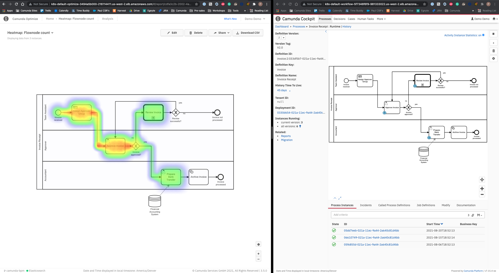

= Install Optimize on AWS EKS
Doc Writer <paul.lungu@camunda.com>
v1.0, 2020-08-13
:toc:

== Disclaimer

IMPORTANT: This document is not intended to create production envronemnt. Rather, it's a refrence to demonstarte a basic simple install of Optimze on AWS EKS. Also to clarify and provide practical architectural guidance for Camunda Optiimze in Kubernetes environments.

== *Step 1*: [[provision-cluster]] Provision Cluster

NOTE: you can skip this if you have done it already with Camunda-HELM and you don't want a separate cluster for Optimize. So you will be installing Optimize into same EKS Cluster.

Otherwise see link:provision-aws-eks.adoc[Provision EKS Cluster] to provision a new cluster on EKS. Keep in mind this is just for testing and not intended setup for production.

== *Step 2*: [[provision-aws-elastic-search]] Provision AWS Elastic Search

See the developer guide https://docs.aws.amazon.com/elasticsearch-service/latest/developerguide/es-gsg-create-domain.html[here]

Use the Console https://console.aws.amazon.com/es/home[here]

WARNING: You will need to use a larger instance so Optimize can do the data import. Unfortunatly the free tear instance wont work. You can still setup for development.

== *Step 3*: Install AWS Ingress Controller

See the doc https://docs.aws.amazon.com/eks/latest/userguide/aws-load-balancer-controller.html[here]

== [[run-camunda]] *Step 4:* Run Camunda
====

To Run Camunda see the

- https://github.com/plungu/camunda-helm[HELM Chart] to install on Kubernetes

- Also see the doc to https://github.com/plungu/camunda-helm/blob/main/docs/install-camunda-aws-eks.adoc[Run Camunda Platform on AWS]

====

== *Step 5*: Configure HELM Charts for Optimize Install

IMPORTANT: For Kubernetes specific docs see link:../README.adoc[Kubernetes Optimize Config Doc]

==== Configure Kubernetes Ingress
====
IMPORTANT: make sure to disable the Nginx Ingress Config

Make sure to enable the elbIngress in the link:../charts/camunda-optimize/values.yaml[values.yaml]

*Defaults Below*
[source,yaml]
----
# Ingress config for AWS EKS ingress controller
elbIngress:
  enabled: true
  annotations: {
    kubernetes.io/ingress.class: alb,
    alb.ingress.kubernetes.io/scheme: internet-facing,
#    alb.ingress.kubernetes.io/target-type: ip,
  }
  hosts:
    path: /*
#  tls: []
#    - secretName: camunda-bpm-platform-tls
#      hosts:
#        - camunda-bpm-platform.local
----
====

=== Change the service
====

IMPORTANT: make sure to change the service.type to NodePort.

[source,yaml]
----
# Using NodePort for AWS EKS Controller
# Use ClusterIP for Nginx Controller
  service:
   type: NodePort
   port: 8080
   portName: http
----
====

==== Configure Connection to Elastic Search
====
See link:../charts/camunda-optimize/values.yaml[values.yaml] to update configs. *You will need to change the `host` and `username` and `password` based on the AWS ElasticSearch config* <<provision-aws-elastic-search,See Step 2>>

See the AWS ES Console https://console.aws.amazon.com/es/home[here]

*Defaults Below*
[source,yaml]
----
# Optimize Elastic connection configurations
# These have not all yet been applied in the data-environment.yaml
elasitc:
  connect:
    timeout: 10000
    credentialsSecertName: "elastic-search-credentials"
    host: "search-camunda-es-3h5avea5b2utan7ilblogq6344.us-west-2.es.amazonaws.com"
    port: "443"
    proxy:
      enabled: false
      host: "localhost"
      port: 80
      sslEnabled: false
    security:
      username: demo
      password: Workflow1!
      ssl:
        enabled: true
        certificate: /optimize/config/cert.pem
        certificate_authorities: []

----
====

==== Installing the certs to connect to elastic search
====
*Use openssl to download the complete cert chain*

 openssl s_client -showcerts -connect <<your-es-domain-endpoint>>:443

*create a pem file by coping the entire cert chain into a file call cert.pem*

*verify the cert chain*

 openssl verify cert.pem

*test the connection with the cert*

 curl --verbose --cacert ~/cert.pem search-camunda-elk-hsrs3ofzhkaraerdg3drvqtwha.us-west-2.es.amazonaws.com

*copy the verified cert chain into the data-cert.yaml*

[source,yaml]
----
apiVersion: v1
kind: Secret
metadata:
  labels:
    {{- include "camunda-optimize.labels" . | nindent 4 }}
  name: optimize-cert
stringData:
  cert.pem: |
    ---
    Certificate chain
    0 s:/CN=*.us-west-2.es.amazonaws.com
    i:/C=US/O=Amazon/OU=Server CA 1B/CN=Amazon
    -----BEGIN CERTIFICATE-----
    MIIF7TCCBNWgAwIBAgIQAZmTO50lRUiZk2Y ...
    -----END CERTIFICATE-----
    1 s:/C=US/O=Amazon/OU=Server CA 1B/CN=Amazon
    i:/C=US/O=Amazon/CN=Amazon Root CA 1
    -----BEGIN CERTIFICATE-----
    MIIESTCCAzGgAwIBAgITBn+UV4WH6Kx33r ...
    -----END CERTIFICATE-----
    2 s:/C=US/O=Amazon/CN=Amazon Root CA 1
    i:/C=US/ST=Arizona/L=Scottsdale/O=Starfield Technologies, Inc./CN=Starfield Services Root Certificate Authority - G2
    -----BEGIN CERTIFICATE-----
    MIIEkjCCA3qgAwIBAgITBn+USionzfP6w ...
    akcjMS9cmvqtmg5iUaQqqcT5NJ0hGA==
    -----END CERTIFICATE-----
    3 s:/C=US/ST=Arizona/L=Scottsdale/O=Starfield Technologies, Inc./CN=Starfield Services Root Certificate Authority - G2
    i:/C=US/O=Starfield Technologies, Inc./OU=Starfield Class 2 Certification Authority
    -----BEGIN CERTIFICATE-----
    MIIEdTCCA12gAwIBAgIJAKcOSkw0grd ...
    -----END CERTIFICATE-----
    ---

----
====

==== Configure the connection to Camunda Platform
====
*Configure the connection to Camunda*

See <<run-camunda, Running Camunda>> to ensure you have a running Camunda instance.

IMPORTANT: You will need to make sure Camunda Platform is accessible to EKS Cluster see https://github.com/plungu/camunda-helm[Camunda-HELM] project to install Camunda Platform.

Go to link:../charts/camunda-optimize/values.yaml[values.yaml] to update configs. Make sure to update the *restUrl* and *webappsUrl* with the correct config from the corresponding Service Endpoint.

You can find your correct Camunda BPM endpoint by checking the Ingress you defined.

  kubectl get ingress --all-namespaces

*Defaults Below*
[source,yaml]
----
# Optimize Camunda Platform connection configurations
# These have not yet been applied in the data-environment.yaml
camunda:
  engine:
    name: "default"
    webappsEnabled: true
    restUrl: "http://k8s-default-workflow-5f7348f6f9-981333022.us-west-2.elb.amazonaws.com/engine-rest"
    webappsUrl: "http://k8s-default-workflow-5f7348f6f9-981333022.us-west-2.elb.amazonaws.com/camunda"
    importEnabled: true
    eventImportEnabled: true
    authentication:
      enabled: false
      user: ''
      password: ''
----
====

== *Step 6*: Run the HELM install

  helm install workflow-demo ./charts/camunda-bpm-platform/

==== Get the Endpoint to access Optimize

  kubectl get ingress --all-namespaces

The value in the address field is the endpoint for accessing Camunda. If you want a more permanent address configure DNS service.

== [[trouble-shooting]] Trouble Shooting

* Get the cluster config

 eksctl get cluster --name camunda-cluster

* Delete stuck pods

 kubectl delete pod <PODNAME> --grace-period=0 --force --namespace <NAMESPACE>

* Get pods

  kubectl get pods

* Get logs for pod

  kubectl logs -f <pod-name>

* Get the public endpoints

  kubectl get ingress --all-namespaces

* Get all services

  kubectl get svc --all-namespaces

* Get the details of a kubernetes component

  kubectl describe <pods, svc, ingress, deploy>

* Pretty print more info about pods and nodes

  kubectl get nodes -o wide |  awk {'print $1" " $2 " " $7'} | column -t

* exec into the pod and confirm the cert.pem exists

The pem file should be in

 cat /optimize/config/cert.pem

* Get a shell into pod

  kubectl exec --stdin --tty <pod-name> -- /bin/bash

* Get max pods per node

Useful when you see errors related to provisioning a pod. i.e. Pod creation errors

Use `describe` command in conjunction to see the pod creation errors

 kubectl get nodes -o yaml | grep pods

 kubectl describe pods <pod-name>